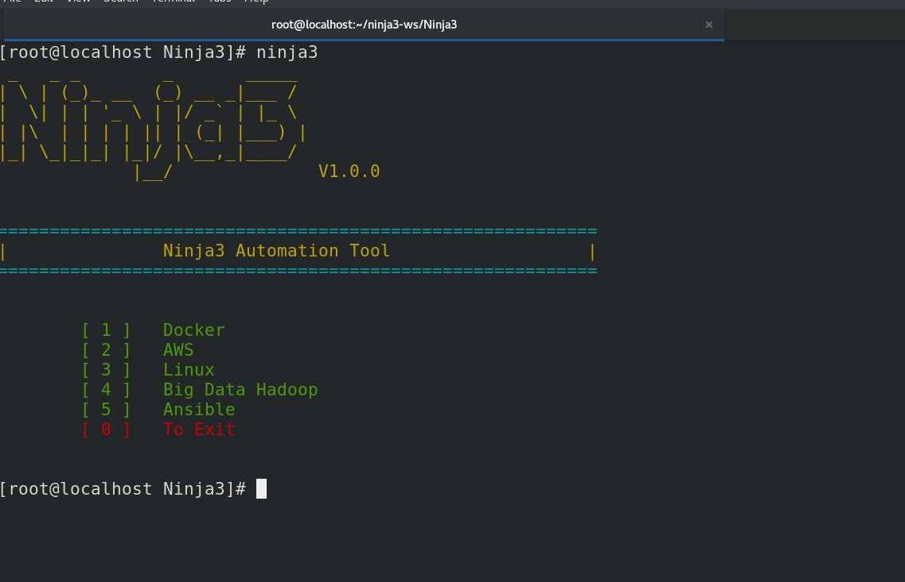
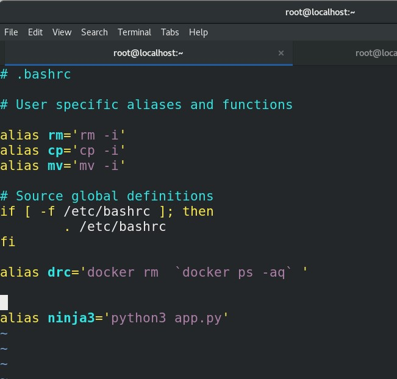
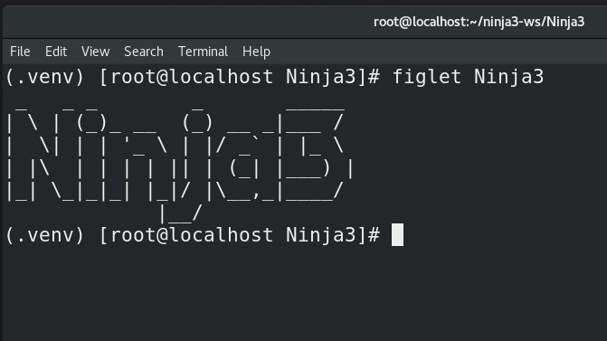

# Ninja3
Open Source Python Software that will be used to integrate Docker, AWS Cloud, Linux, Ansible, BigData Hadoop, etc

## To run this Python Program as a command in Linux
$ vim ~/.bashrc 

alias ninja3='python3 app.py'

$ exec bash 

## Create a new environment
$ python3 -m venv .venv
$ source .venv/bin/activate

## Install Figlet Package in your RedHat/Centos OS
figlet is in Fedora/EPEL, so you really don't want to get it from anywhere else.

$ yum install https://dl.fedoraproject.org/pub/epel/epel-release-latest-8.noarch.rpm

$ yum install figlet

## Install Python3 Requirements
$ pip install --upgrade pip
$ pip install -r requirements.txt
